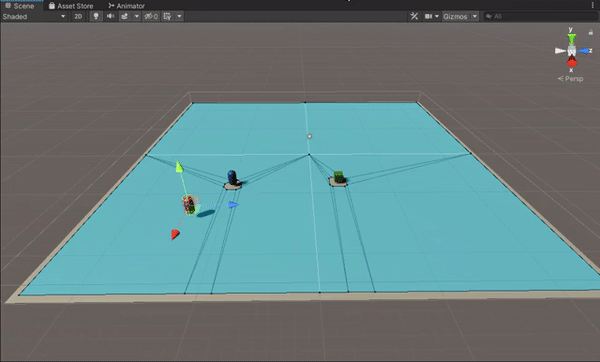
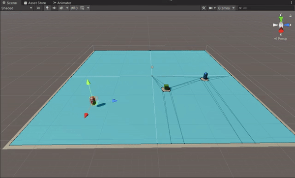
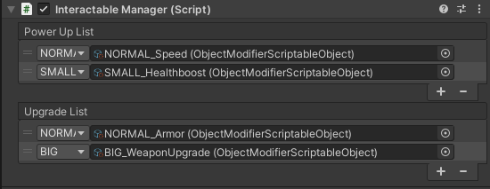
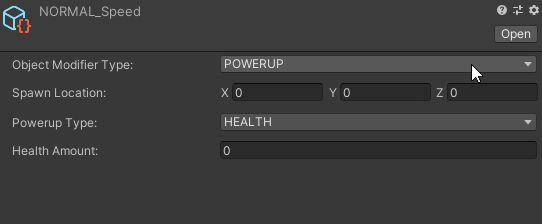
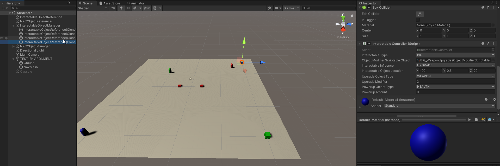

# MasterProject# MasterProject: 
## What are the behaviourial changes of NPC's in a simulation environment set by the player?
In dit project is mijn doel om onderzoek te doen rond hoe de speler een effect kan hebben op een simulatie door de speler bepaalde variabelen te laten bepalen en hoe ik dit allemaal kan gebruiken voor een leuke demo game.

### Prototype 1: Movement towards object or other NPC
In mijn eerste prototype ging het vooral om er voor te zorgen dat de NPC een beslissing zou maken tussen het bewegen naar een andere NPC of eerst naar een object en dan pas naar een NPC.

Dit gebruik ik als een rudimentaire prototype waar ik later op kan verder werken door middel van *Weights*. 

Ik maak gebruik van de Unity Asset: *NavMeshComponents*. Dit is een meer advanced NavMeshComponent, waar ik de NavMesh in runtime mee kan aanpassen, speciale zones kan aanpassen
en deze ook tijdens runtime aanpassen indien nodig.

* *NavMeshComponents zijn componenten die van Unity zelf die je kan gebruiken via de Unity.AI namespace. Deze maakt van je level een plattegrond en zorgt ervoor dat objecten afgelijnd zijn en ook dynamisch afgelijnd kunnen worden tijdens beweging. Deze plattegrond wordt dan gebruikt door de KI die dan de A\* pathfinding methode gebruikt om zo het efficientste pad te zoeken naar zijn doel.*

* *Weights is een term gebruikt om aan te tonen hoe belangrijk een actie is voor een KI (Kunstmatige Intelligentie). In mijn geval gaat de KI weights gebruiken om te beslissen welk object het beste voordeel geeft*.

Om deze beslissing te laten maken heb ik moeten zoeken naar een bepaalde formule. Uiteindelijk kwam ik zo op de volgende formule dat de NPC zou gebruiken om naar de dichtsbijzijnde NPC te gaan:

**(NearestNPC_Health / (damage * multiplier * attackSpeed) + (distanceNearestNPC / 7)) - (NearestNPC_Health / (damage * multiplier * attackSpeed) + (distanceNearestObject + distanceNearestNPC / 7)) > 15**

De getallen 7 en 5 zijn magic numbers die ik op dit moment gebruik om de volgende redenen: 
- De NPC heeft een speed van 8 en heb uitgerekend dat door deze speed de NPC 7 units of distance behaald per seconde.
- Het getal 5 is gewoon een minimum verschil dat ik verwacht voordat de NPC voor het Object zou gaan.

Door deze formule kan ik de NPC al zelf bepalen wat een betere keuze is, door de vergelijking te maken van hoe lang het duurt om de andere NPC's te doden.
Hieronder zijn drie scenario's die een visueel beeld geven over wat er gebeurd.

**Scenario 1: Afstand van de NPC is kleiner dan het object en de multiplier is te laag om invloed te hebben.**

**Scenario 2: Afstand van de NPC is groter dan het object en de multiplier is goed genoeg om invloed te hebben.**

**Scenario 3: Afstand van de NPC is kleiner dan het object en de multiplier is goed genoeg om invloed te hebben.**

### Prototype 2: Interactable Object System

In deze prototype is het de bedoeling dat ik een systeem ontwerp die ik later kan laten werken met een UI systeem zodat de speler tijdens de runtime een Interactable Object kan aanmaken en deze dan door het spel gebruikt kan worden.

Hiervoor moest ik op voorhand beslissen welke gegevens belangrijk zijn om mee te geven aan het systeem en welke scripts ik nodig ga hebben. De structuur die ik dan heb gekozen is de volgende:

* Interactable Object Manager: Dit script gaat er voor zorgen dat alles ordelijk in een lijst terecht komt afhankelijk van het type van Interactable Object (hier komt meer later over). Deze lijsten worden opgevuld met Scriptable Objects.

  * Interactable Object ScriptableObject: Dit script is de basis van de Scriptable Object die ik in de Object Manager steek. Hier kan ik gegevens aan doorgeven die het Object zelf later gaat kunnen lezen.
  
    * Interactable Object Controller: Dit script beheert het Object zelf. Hierin zit de belangrijke functionele code die ervoor zorgt dat het Object veranderd afhankelijk van de gegevens.
    
       * Interactable Object: Dit is het 3D - model van het Object. Deze wordt volledig beinvloed door bovenstaande code en wordt gegenereerd via het ScriptableObject.

Zoals eerder aangehaald zijn er verschillende Interactable Object Types. Deze zijn: Powerup en Upgrade. Beide kunnen een ander effect hebben op de NPC. Voor dit prototype kan de - Powerup dienen als: Health of Speed boost. 
- Upgrade dienen als: Armor of Weapon upgrade.

De Interactable Objects kunnen ook op drie verschillende grootes zitten:
- Small (Groen)
- Normal (Rood)
- Big (Blauw)

Dit dient om aan te tonen welke NPC's kunnen interacten met welk Interactable Object. Dit is aan te tonen door de kleur van het model.

**Interactable Object Manager**

**Interactable Object ScriptableObject**

**Interactable Object Controller**

In de afbeelding hieronder kan je zien dat het geselecteerd object zich onder de InteractableObjectManager plaatst. Dit object neemt als model referentie de prefab: InteractableObjectReference die ook te zien valt in de hierarchy. In de Scene kan je zien welk object geselecteerd is en welke kleur het heeft. Tenslotte in de Inspector kun je zien dat de Interactable Object Controller de gegevens van de ScriptableObject heeft overgenomen. De groote van dit object is Big dus is de material kleur ook blauw.

